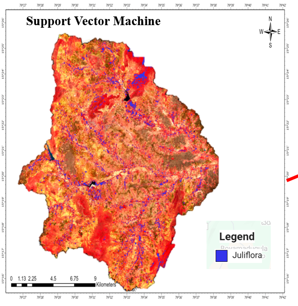

🌿 Juliflora Detection and Classification using Sentinel-2 and PCA

This project implements a Juliflora (Prosopis juliflora) detection and mapping system using Sentinel-2 Surface Reflectance imagery and advanced machine learning classifiers in Google Earth Engine (GEE).
It leverages Principal Component Analysis (PCA) to enhance feature separability and applies SVM, Random Forest, and Gradient Tree Boosting for accurate classification.

🚀 Key Features

🗺️ AOI Mapping: Automatic visualization of the Area of Interest (AOI) on GEE.
🛰️ Sentinel-2 Data Processing: Filters images by date, bounds, and cloud coverage (<1%).
📊 PCA Transformation: Reduces dimensionality for better classifier performance.

Machine Learning Classifiers:

🤖 SVM (Support Vector Machine)
🌲 Random Forest (RF)
⚡ Gradient Tree Boosting (GTB)
✅ Accuracy Assessment: Confusion Matrix, Precision, Recall, F1 Score, and RMSE calculation for each classifier.
📏 Juliflora Area Calculation: Computes total affected area in square meters for each classifier.
💾 Export Functionality: Classified maps are exported as GeoTIFF for further GIS analysis.
🎨 Interactive Legend: Custom legend for visualization on GEE map.

🛠 Tools & Technologies

Google Earth Engine – cloud-based geospatial processing
Sentinel-2 Level-2A SR Imagery – multi-spectral satellite imagery
JavaScript – GEE scripting
Machine Learning – SVM, RF, GTB classifiers
Export – GeoTIFF for GIS analysis

⚡ How to Use

Open Google Earth Engine Code Editor.
Upload the AOI shapefile and feature collections for Juliflora and non-Juliflora.
Paste the script and run it.
Visualize classified layers and export results to Google Drive.

📈 Results

Provides accurate mapping of Juliflora spread over the AOI.
Generates classifier-wise performance metrics (Precision, Recall, F1 Score, RMSE).
Exports GeoTIFF files ready for further GIS applications.

# Julliflora Project

## 📊 Results

### Model Performance

- **Accuracy**
  

- **F1 Score**
  

- **RMSE**
  

### Model Comparisons

- **SVM**
  

- **Random Forest**
  

- **Gradient Boosted Trees**
  

### Feature Analysis

- **PCA Visualization**
  

- **Training Samples**
  

